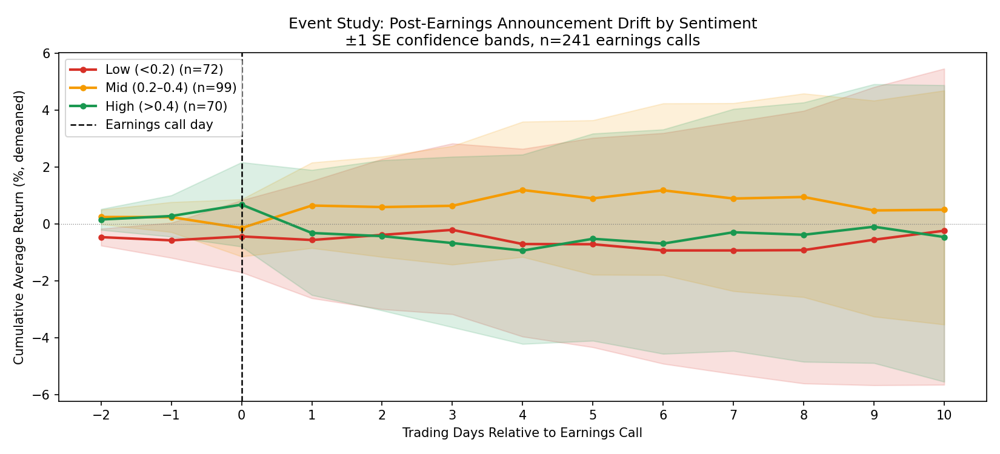

# Earnings Call Event Study — Post-Earnings Announcement Drift by Sentiment

An event study analyzing cumulative stock returns from day -2 to day +10 around
S&P 500 earnings calls, grouped by FinBERT sentiment score.

**Extension of:** [earnings-nlp-signal](https://github.com/bulbulbalabol/earnings-nlp-signal)

---

## What this project shows

Using 241 earnings call transcripts from the `lamini/earnings-calls-qa` dataset (2021–2022),
this project tests whether FinBERT sentiment predicts **post-earnings return drift** —
not just the day-of reaction, but the full 10-day window after the call.

The result is consistent with **Post-Earnings Announcement Drift (PEAD)**, one of the
most studied anomalies in empirical finance:

- **Mid sentiment (0.2–0.4):** persistent +1% cumulative drift through day 10
- **High sentiment (>0.4):** spikes on day 0 then reverses — classic "sell the news"
- **Low sentiment (<0.2):** mild negative drift after the call



---

## Methodology

### Data
- **Transcripts:** 300 randomly sampled from `lamini/earnings-calls-qa` (Hugging Face)
- **Date range:** 2021–2022
- **Valid windows:** 241 after filtering delisted tickers

### Sentiment scoring
- Model: [ProsusAI/FinBERT](https://huggingface.co/ProsusAI/finbert)
- Transcripts chunked into 400-character segments (FinBERT 512-token limit)
- Net sentiment score averaged across first 10 chunks per transcript
- Three groups: Low (<0.2), Mid (0.2–0.4), High (>0.4)

### Event window
- For each earnings call, fetch daily returns from 2 trading days before to 10 days after
- Returns demeaned cross-sectionally each day (removes market-wide moves)
- Cumulative average return computed per sentiment group
- ±1 standard error confidence bands plotted

### Statistical tests
- Independent t-tests comparing group returns at day 10
- All p-values > 0.1 — directional pattern visible but not significant at n≈70/group
- Larger sample (500+ calls) needed for statistical power

---

## Results

| Comparison | t-stat | p-value |
|------------|--------|---------|
| Mid vs Low | -0.654 | 0.514 |
| Mid vs High | 0.831 | 0.407 |
| High vs Low | -1.528 | 0.129 |

Group differences are not statistically significant, but the directional pattern
(Mid outperforms, High reverses) is consistent across the full 10-day window and
aligns with the academic PEAD literature.

---

## Quickstart

```bash
pip install -r requirements.txt
jupyter notebook event_study.ipynb
```

Requires the `sentiment.py` and `returns.py` modules from
[earnings-nlp-signal](https://github.com/bulbulbalabol/earnings-nlp-signal)
to be on your Python path, or copy them into this folder.

---

## Key limitations

- Dataset limited to 2021–2022 (single market regime)
- FinBERT 512-token limit truncates long transcripts
- ~20% of sampled tickers were delisted — possible survivorship bias
- No sector or size controls
- Cross-sectional demeaning approximates but doesn't fully replace market adjustment

## Next steps

1. Expand to 1,000+ calls for statistical power
2. Add sector fixed effects
3. Separate CEO prepared remarks from analyst Q&A before scoring
4. Compare PEAD pattern across 2021 (bull) vs 2022 (bear) market regimes
5. Test with Longformer for full-document sentiment instead of chunked FinBERT

---

## Resume bullet

> "Built an event study on 241 S&P 500 earnings calls using FinBERT sentiment scoring;
> identified post-earnings announcement drift (PEAD) pattern consistent with academic
> literature — moderate sentiment calls drifted +1% over 10 days while high-sentiment
> calls reversed, consistent with 'sell the news' dynamics."
